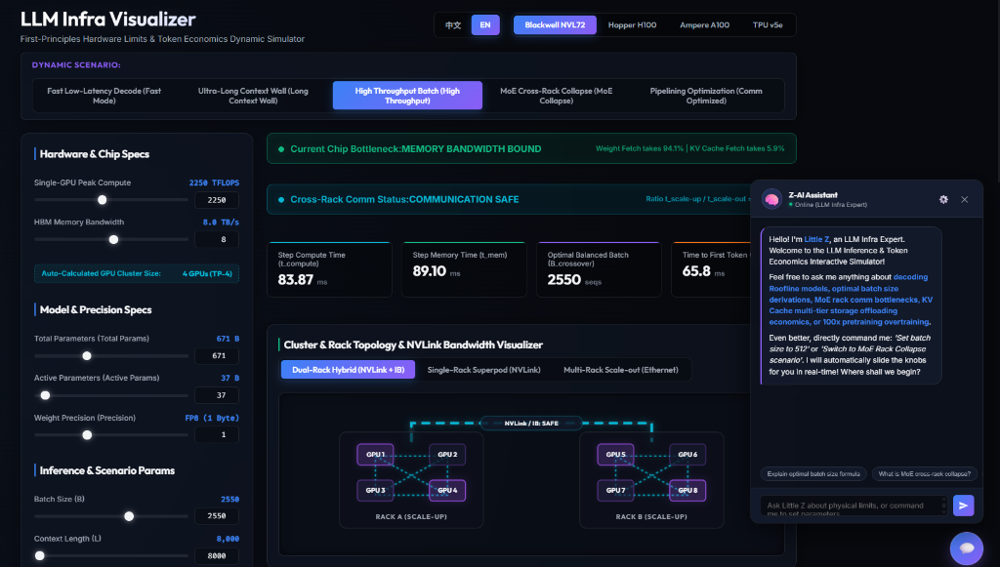

# LLM 推論與 Token 經濟學互動遙測面板 (LLM Infra Visualizer)

這是一個專為 LLM 基礎設施工程師、開發者及研究人員設計的第一性原理（First Principles）互動式模擬器。本專案能實時模擬硬體運算邊界、記憶體之牆悖論、網路通訊瓶頸，以及在部署 Dense（稠密）與 MoE（混合專家）模型時，KV Cache 的多級存儲（HBM、DDR、SSD）機會成本折算。




## 核心功能

### 1. 互動式 Roofline 理論模型
- **瓶頸實時渲染**：動態繪製推論邊界。當你調整 Batch Size 時，能直觀看到系統何時從 **記憶體頻寬受限 (Memory-bound)**（低 Batch 解碼階段）過渡到 **算力受限 (Compute-bound)**（高 Batch 預熱或吞吐階段）。
- **記憶體之牆預熱悖論**：物理還原為何當 Prompt 長度 $L > 300$ tokens 時，Prefill 階段（TTFT）在數學上必然是算力受限，而 Decode 階段則必然受限於記憶體頻寬。

### 2. 多 GPU 集群拓撲與 Tensor Parallelism 分片遙測
- **主流晶片預設**：內建 Nvidia Blackwell、Hopper H100、Ampere A100 及 Google TPU 的真實物理規格。
- **動態集群分片**：模擬張量並行（Tensor Parallelism, TP-1 到 TP-8）的硬體開銷。系統會根據你的參數大小與 KV Cache 佔用量，自動推算所需的最小 GPU 數量與分片邊界。
- **Dense vs. MoE 動態視覺化**：
  - **Dense 模型** ($P_{\text{active}} == P_{\text{total}}$)：觸發全 GPU 同步的青藍色心跳呼吸動畫（代表無 Expert Routing 通訊開銷）。
  - **MoE 模型** ($P_{\text{active}} < P_{\text{total}}$)：觸發非同步、交錯的紫色波浪動畫（代表稀疏激活時的跨卡 All-to-All 路由通訊延遲）。

### 3. KV Cache 多級存儲經濟學
- **多級儲存成本對比**：實時計算與對比以下四種 KV Cache 持有策略的總體成本與檢索延遲：
  - **GPU HBM**（極昂貴的顯存租金）
  - **主機 DDR 記憶體**（受限於 PCIe 頻寬的卸載）
  - **NVMe SSD**（超平價但檢索延遲高的冷存儲）
  - **重算機制 (Rematerialization)**（用算力換取顯存空間的機會成本折算）
- 幫助你精確評估在不同的對話保留時間（$T_{\text{hold}}$）下，推論引擎的最佳緩存策略。

### 4. 內建 AI 專家助理「小Z」(Little Z)
- **硬核對話**：內建基於第一性原理的 LLM Infra 專家助理，支持 Streaming 串流輸出。
- **反向控制網頁**：小Z內建 Agent 控制能力。當你在對話框中要求他調整場景時（例如：「幫我切換到極長上下文牆」或「把 Batch 改成 1024」），小Z會自動輸出 JSON 指令，直接驅動網頁上的滑桿與配置進行實時物理連動！
- **需自備 API 連線設定**：本專案為純前端靜態網頁，不內建免費的後端 LLM 算力。若要啟用小Z對話功能，你必須點擊聊天面板右上角的齒輪圖示，自行填入可用的 API Endpoint、API Key 及模型名稱。本工具支援任何與 OpenAI 格式相容的 API 連線（例如 OpenAI、DeepSeek、Anthropic 或本地運行的 Ollama）。

---

## 底層物理公式

### 解碼單步延遲 (Step Latency)
$$t_{\text{step}} = \max(t_{\text{compute}}, t_{\text{mem}})$$

- **純運算時間 (Compute Bound Latency)**：
  $$t_{\text{compute}} = \frac{2 \cdot B \cdot P_{\text{active}}}{F}$$
- **記憶體讀取時間 (Memory Bandwidth Bound Latency)**：
  $$t_{\text{mem}} = \frac{P_{\text{total}} \cdot \text{precision} + B \times L \times \text{kvToken}}{\text{bandwidth}}$$

其中：
- $B$：Batch Size (批次大小)
- $L$：Context Length (當前上下文 Token 長度)
- $P_{\text{active}}$ / $P_{\text{total}}$：激活參數 / 總參數量
- $F$：集群總算力 (FLOPS)
- $\text{kvToken}$：單個 Token 的 KV Cache 位元組數
- $\text{bandwidth}$：集群 HBM 總頻寬

---

## 快速開始

本專案為純前端應用，採用 **Vanilla HTML5, CSS3, and JavaScript** 開發。

1. **複製專案庫**：
   ```bash
   git clone https://github.com/yourusername/llm-token-economics.git
   cd llm-token-economics
   ```
2. **啟動**：
   無需任何安裝、建置或後端伺服器配置。直接在瀏覽器（推薦 Chrome、Edge 或 Firefox）中雙擊開啟 `index.html` 即可運作。
   
3. **語系切換**：
   點擊網頁右上角的語系切換按鈕，即可隨時在 英文 (English) 與 繁體中文 之間進行切換。

## 第三方依賴項目

專案的圖表與數學公式排版均透過 CDN 載入：
- **Chart.js**：高效能互動式圖表渲染。
- **KaTeX**：極速 LaTeX 數學公式排版。

## 授權條款

本專案開源，採用 MIT 授權條款。
